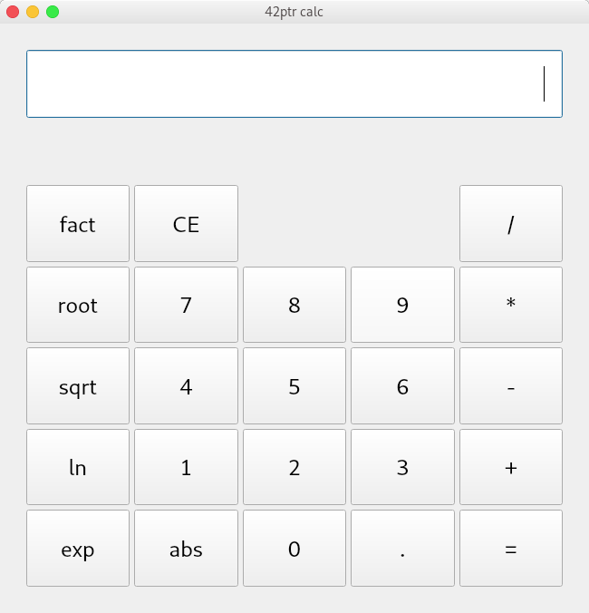

# 42ptr Kalkulačka - Open Source

Jednoduchá kalkulačka s GUI rozhraním, vlastným inštalátorom, dokumentáciou  
a taktiež príručným manuálom pre uľahčenie použiteľnosti



## Základné informácie

### O projekte

Projekt je zameraný na skúšku práce v tíme a využívaniu efektívnych  
a moderných technológií pre vzdialenú prácu v tímových projektoch  
(napr.: GitHub - internetová služba poskytujúca bezplatný webhosting pre open src projekty).

### O kalkulačke

Program kalkulačky je písaný v jazyku ``Python`` a GUI je riešené pomocou ``PyQt``.  
Kalkulačka v sebe obsahuje sadu základných operácií (+,-,*,/,!,ln,sqrt,root,...).  
Taktiež pomocou kalkulačky je možné premeniť čísla z binárnej,hexadecimálnej a oktálovej  
sústavy na desiatkovú (pre zjednodušenie počtov).  
Tieto funkcie, ale ešte nie sú pridané do výslednej podoby kalkulačky, a preto sme sa rozhodli  
ich pridať v budúcej verzii a pridávame ich do mockupu kalkulačky, ktorý nájdete v zložke mockup
Výzor kalkulačky sme nechali na preferencie užívateľa, to znamená, že sa prispôsobí téme,  
ktorú má užívateľ nastavenú vo svojom systéme.

## Ako začať

### Stiahnutie kalkulačky
Prvý krok je naklonovanie repozitára do vášho zariadenia, pre túto akciu stačí napísať jednoduchý príkaz do konzoly:  
```git clone https://github.com/Majdos/42ptr-calc.git```

### Inštalácia zo zdrojového kódu
Najprv sa musíte premiestniť do priečinka, ktorý ste si naklonovali v predošlom kroku.    
Následne presnejšie inštrukcie ako nainštalovať prostredie sú dostupné v [dokumentácii](https://github.com/Majdos/42ptr-calc/blob/master/docs/source/install.md)

## Cieľové platformy

Windows 64bit

## Autori

42ptr
- xlorin01 Marián Lorinc ([Majdos](https://github.com/Majdos))
- xjavor20 Lukáš Javorský ([xjavor20](https://github.com/xjavor20))
- xondri08 Patrik Ondriga ([tenOndro](https://github.com/tenOndro))
- xvinar00 Peter Vinarčík ([bixorko](https://github.com/bixorko))

## Licencia

Tento program je poskytovany pod licenciou [GPL-3.0](https://github.com/Majdos/42ptr-calc/blob/master/LICENSE)
